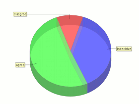

# Bullshit-Charts 

> Never trust a statistics you didn't forge yourself.

_bullshitcharts_ is a Java web site that generates random fake charts.

## Usage

Just execute `mvn clean install`, and then run the generated WAR file on a Java web container of your choice.

Alternatively, you can use docker. Execute `mvn clean install docker:build` to build the docker image. Then execute `mvn docker:start` to start the image, and point your browser to http://localhost:8080/.

_bullshitcharts_ is a standalone tool. It does not need a database or a volume.

## Contribute

* Fork the [Source code at GitHub](https://github.com/shred/bullshitcharts). Feel free to send pull requests.
* Found a bug? [File a bug report!](https://github.com/shred/bullshitcharts/issues)

## License

Bullshit Charts is distributed under [GPLv3](http://www.gnu.org/licenses/gpl-3.0.html).
